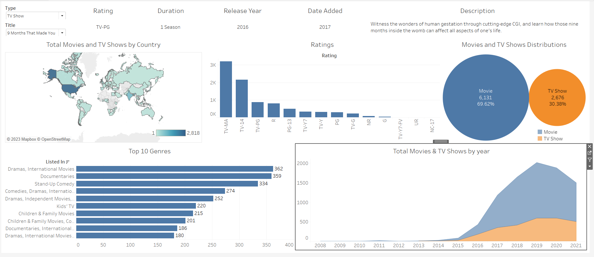

# Tableau Dashboard for Netflix Movies and TV Shows 
# Check it out at https://asm3515.github.io/Netflix_Dashboard/

Welcome to the Tableau Dashboard for Netflix Movies and TV Shows! This dashboard provides a comprehensive view of Netflix's vast library of movies and TV shows, allowing users to explore and analyze the available content.

## Overview

The Tableau Dashboard is designed to offer insights into various aspects of Netflix's entertainment offerings. Users can discover trends, patterns, and interesting information about the extensive collection of movies and TV shows available on the platform.

## Features

### 1. Data Exploration

- **Movies vs. TV Shows:** Explore the distribution of content between movies and TV shows on Netflix.
- **Genre Analysis:** Understand the distribution of genres to identify popular categories.
- **Release Years:** Analyze the distribution of content based on release years.

### 2. Top Lists

- **Top Rated:** Discover the highest-rated movies and TV shows on Netflix.
- **Most Watched:** Identify the most-watched content based on user ratings and views.

### 3. Content Details

- **Title Information:** Get detailed information about specific movies or TV shows.
- **Duration Analysis:** Explore the average duration of movies and TV shows available on Netflix.

### 4. User Engagement

- **User Ratings:** Analyze user ratings for movies and TV shows.
- **Viewing Trends:** Understand viewing trends over time.

## How to Use

1. **Filtering:** Use filters to narrow down your search based on genres, release years, or content type (movies/TV shows).
2. **Interactivity:** Click on specific data points to get more detailed information.
3. **Top Lists:** Explore the top-rated and most-watched content easily.

## Getting Started

To use the Tableau Dashboard:

1. Clone this repository to your local machine.
2. Open the Tableau Dashboard file in your Tableau Desktop application.
3. Start exploring Netflix movies and TV shows data.

## Data Source

The data used in this dashboard is sourced from Netflix and is periodically updated to provide the latest information.

## Feedback

We welcome your feedback! If you have suggestions, find issues, or want to contribute, please open an issue or submit a pull request.

Happy exploring!

